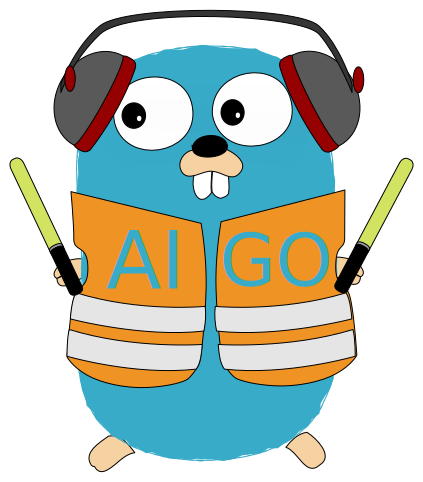
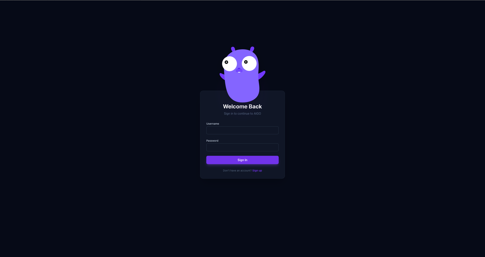
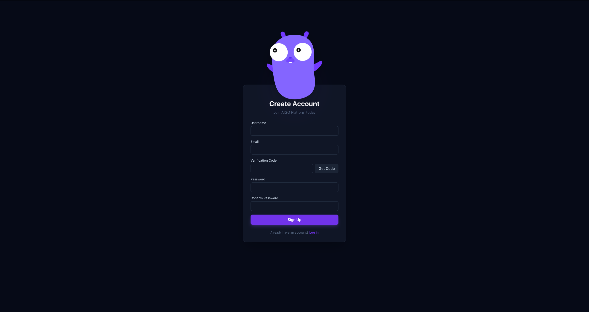
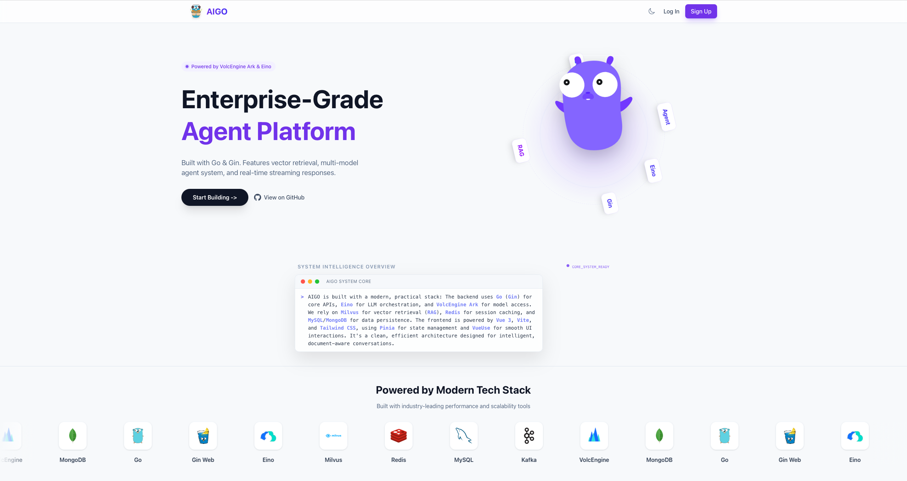
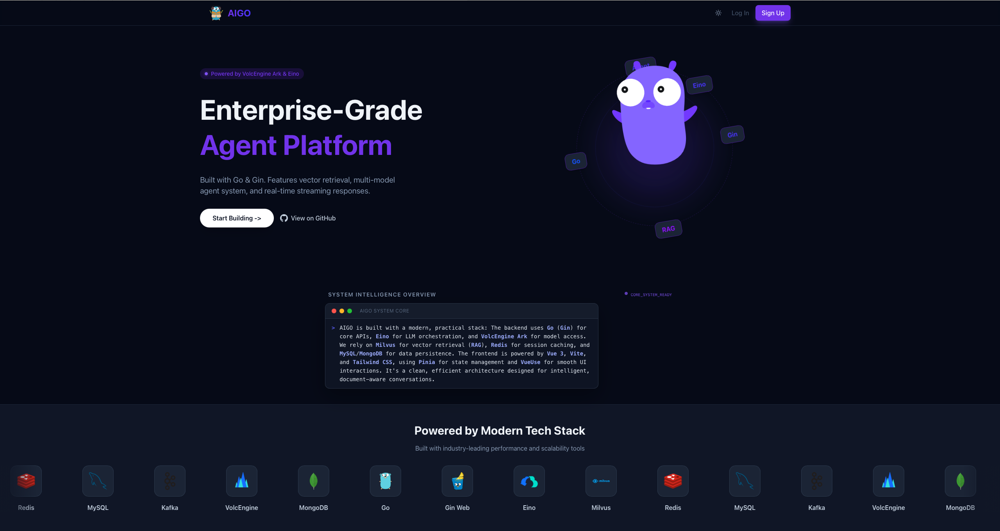
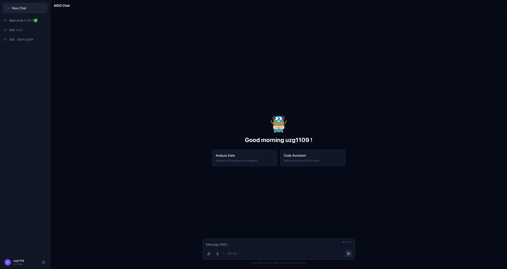
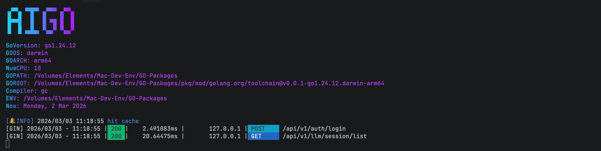

<p align="center"> 
  <a href="#">
    
  </a>
</p>

<h1 align="center">AIGO</h1>

<p align="center">
  <a href="https://opensource.org/licenses/Apache-2.0"></a>
  <a href="#"></a>
  <a href="#"></a>
  <a href="#"></a>
</p>

<p align="center">
AIGO 是一个基于 Eino 框架构建的高性能、可扩展的开源智能 Agent 平台。它集成了大语言模型 (LLM) 对话、检索增强生成 (RAG) 以及完善的用户管理系统，旨在为开发者提供一个开箱即用的 AI 应用基础架构。
</p>

## ✨ 核心特性

- **🤖 智能对话**: 基于 Eino 框架实现, 支持与大模型进行深度对话。
- **🔍 检索增强生成 (RAG)**: 集成 Milvus 向量数据库, 支持私有知识库检索问答。
- **💨 流式响应**: 支持 SSE (Server-Sent Events) 协议, 实现极致流畅的对话体验。
- **📂 文件管理**: 支持多种格式文件上传、自动分词索引, 并提供在线代码预览。
- **🛡️ 安全中心**: 完善的 JWT 鉴权体系, 支持邮箱验证码登录与注册。
- **🎨 主题适配**: 内置深色/浅色模式, 支持手动切换或跟随系统设置。
- **📱 响应式设计**: 适配 PC 与移动端, 提供一致的交互体验。

## 🖼️ 界面展示

<table width="100%">
 <tr>
    <td align="center"><strong>登录界面</strong></td>
    <td align="center"><strong>注册界面</strong></td>
 </tr>
  <tr>
    <td width="50%"></td>
    <td width="50%"></td>
  </tr>
  <tr>
    <td align="center"><strong>聊天界面 (浅色)</strong></td>
    <td align="center"><strong>聊天界面 (深色)</strong></td>
  </tr>
  <tr>
    <td></td>
    <td></td>
  </tr>
  <tr>
    <td align="center"><strong>实时对话</strong></td>
    <td align="center"><strong>后端启动</strong></td>
  </tr>
  <tr>
    <td></td>
    <td></td>
  </tr>
</table>

## 🏁 快速开始

我们提供两种方式来启动项目，推荐使用 Docker Compose。

### 方式一：使用 Docker Compose (推荐)

此方法将使用 Docker 启动所有必需的中间件服务 (Milvus, Etcd, Kafka 等)。

1.  **启动中间件**

    进入 `deploy` 目录并使用 Docker Compose 启动所有服务：
    ```bash
    cd deploy
    docker-compose up -d
    ```

2.  **配置并启动后端服务**

    *   将 `config/config.yaml.example` 复制为 `config.yaml`。
    *   (如果需要) 根据 `docker-compose.yml` 中的服务地址修改 `config.yaml`。
    *   启动后端：
    ```bash
    go run cmd/main.go
    ```

3.  **启动前端服务**

    *   进入 `ui` 目录，安装依赖并启动：
    ```bash
    cd ui
    npm install
    npm run dev
    ```

### 方式二：手动部署

如果您希望手动管理所有服务，请按以下步骤操作。

1.  **准备环境**

    确保您已手动安装并启动了以下服务：
    *   MySQL
    *   Redis
    *   MongoDB
    *   Milvus
    *   Etcd
    *   Kafka

2.  **配置并启动后端服务**

    *   将 `config/config.yaml.example` 复制为 `config.yaml` 并填入您的服务连接信息。
    *   启动后端：
    ```bash
    go run cmd/main.go
    ```

3.  **启动前端服务**

    *   进入 `ui` 目录，安装依赖并启动：
    ```bash
    cd ui
    npm install
    npm run dev
    ```

### 访问应用

项目启动后，在浏览器中打开 `http://localhost:5173` (或 Vite 启动时提示的其他地址)。

## 🗺️ 开发路线图

以下是项目未来的开发计划，我们欢迎并鼓励社区成员参与贡献！

| 状态 | 优先级 | 功能模块 | 详细描述 |
| :---: | :---: | :--- | :--- |
| ✅ | - | 邮件模板 | 优化邮件发送模板，支持响应式布局。 |
| ✅ | - | 主题与导航 | 首页支持主题切换（暗黑/亮色/自动）和轮播图跳转。 |
| ✅ | - | 容器化部署 | 提供 Docker Compose 配置用于一键部署所有中间件。 |
| 🚧 | 高 | Bug 修复 | 解决局域网访问时，语音输入按钮失效的问题。 |
| 🚧 | 高 | 性能优化 | 优化 PDF 及其他文件的切片和索引速度，考虑使用协程池。 |
| 🚧 | 高 | 代码质量 | 解决后端遗留的 TODO，清理不必要的日志，优化前后端错误处理。优化会话删除后的调用链|
| 🚧 | 中 | 用户体验 | AI 输出内容的 Markdown 自动解析和美化。 |
| 🚧 | 中 | 文件管理 | 在对话界面右上角显示已上传文件列表，并支持点击预览。 |
| 🚧 | 中 | 监控 | 完善 Prometheus 指标采集和 Grafana 可视化，监控 Token 消耗等。 |
| 🚧 | 中 | 链路追踪 | 利用 Jaeger 进一步定位和优化慢调用，提升系统响应速度。 |
| 🚧 | 中 | 模型支持 | 在聊天页面支持动态选择不同的 LLM 厂商。 |
| 🚧 | 低 | 国际化 | 完善 i18n 多语言支持，优化现有文字描述。 |
| 🚧 | 低 | 测试 | 上线前的最终测试。 |
| 🚀 | 远期 | 高级功能 | 支持用户自定义模型 API Key，或接入本地 Ollama 模型。 |
| 🚀 | 远期 | 高级功能 | 实现基于 MCP 的多 Agent 编排、图编排、多模型对话、ReAct 等高级功能。 | 

## 🤝 如何贡献

我们非常欢迎各种形式的贡献！无论是提交 Bug、建议新功能还是直接贡献代码，请随时创建 Issue 或 Pull Request。

## 📄 许可证

本项目基于 [Apache 2.0 License](LICENSE) 开源。
